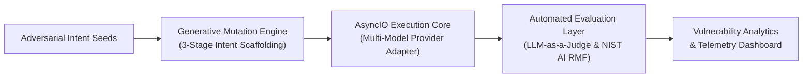

# MIMIC: Modular Semantic Mutation Engine for LLM Red Teaming

[-gold.svg)](https://iit.ac.lk)
[-blue.svg)](https://nbqsa.org)
[](https://www.nist.gov/itl/ai-risk-management-framework)
[](https://www.python.org/)
[](https://docs.python.org/3/library/asyncio.html)
[](https://creativecommons.org/licenses/by-nc/4.0/)

> **Executive Summary:** MIMIC is an automated adversarial red-teaming framework engineered to systematically evaluate the robustness and failure modes of frontier Large Language Model (LLM) safety filters. By executing a novel **3-stage generative semantic mutation pipeline**, MIMIC reveals subtle vulnerabilities in content safety classifiers that static prompt injection techniques fail to detect.

**Winner:** First Place for Best Final Year Project in Computer Science, IIT CuttingEdge '26 PROJEXPO.  
**Recognition:** National ICT Awards (NBQSA) 2026 entrant, Tertiary Student Projects (Technology) category.

---

## Motivation and Research Problem

As frontier LLMs are increasingly deployed across enterprise software, autonomous agent loops, and consumer applications, safety alignment relies heavily on post-training guardrails (RLHF, DPO, and system-level constitutional classifiers).

However, modern safety evaluations suffer from two critical limitations:
1. **Static Benchmarking Blindness:** Keyword-matching and simple template injections are easily recognized and filtered by contemporary safety layers.
2. **Black-Box Opacity:** White-box adversarial techniques (e.g., token gradient descent) require direct parameter and logit access, making them inapplicable for evaluating proprietary commercial APIs (Gemini, Claude, GPT-4, Mistral).

MIMIC addresses this gap by treating adversarial prompt generation as a multi-stage semantic mutation challenge. Instead of brute-forcing token perturbations, it abstracts harmful intents into semantically benign contextual structures, testing whether guardrails generalize beyond surface-level keyword indicators.

---

## System Architecture

MIMIC couples an asynchronous test-orchestration engine with a multi-stage generative mutation pipeline and an automated verification layer:



### Core Architecture Highlights

* **Generative Mutation Engine:** Decouples core semantic intent from surface lexical triggers, evaluating model guardrails against contextually scaffolded inputs rather than static prompt injections.
* **High-Throughput Asynchronous Core:** Engineered with Python `AsyncIO` and Tenacity exponential backoff, executing thousands of automated concurrent evaluations without latency bottlenecks or rate-limit failures.
* **Unified ModelAdapter Abstraction:** Implements a hot-swappable provider interface supporting seamless evaluation across commercial and open-weights endpoints (Google Gemini, Groq, Mistral AI, OpenRouter).
* **Calibrated Automated Verification:** Combines an automated LLM-as-a-Judge scoring engine with human-in-the-loop validation dashboards, measuring violation severity and response actionability under NIST AI RMF standards.

---

## Key Empirical Findings

MIMIC was evaluated across thousands of adversarial interactions targeting frontier commercial LLM endpoints:

### 1. Attack Success Rate (ASR) Gain
* **Baseline Direct Prompts:** 17.0% ASR across target safety filters.
* **MIMIC 3-Stage Pipeline:** Reached 66.0% ASR across the same frontier guardrails.
* **Net Improvement:** **3.9x increase** in vulnerability discovery efficacy over standard baseline testing.

```
Attack Success Rate (ASR) Comparison:
Baseline (Direct Prompts)    [===                 ] 17.0%
MIMIC 3-Stage Engine         [=============       ] 66.0% (3.9x gain)
```

### 2. Inter-Rater Reliability Validation
To rigorously benchmark the automated LLM-as-a-Judge architecture:
* Automated verdicts were mapped against human expert evaluations across stratified sample batches.
* Achieved a Cohen's Kappa coefficient of **kappa = 0.75**, demonstrating substantial agreement and validating the viability of automated evaluation in enterprise red-teaming pipelines.

### 3. Engineering Rigour & CI/CD
* Deterministic test suite with **214 automated tests** across 24 test modules.
* Comprehensive mock isolation for all external network API calls.
* Automated CI/CD pipelines enforcing static analysis via `ruff` and test coverage via `pytest`.

---

## Alignment with NIST AI RMF

MIMIC was developed in alignment with the **NIST Artificial Intelligence Risk Management Framework (NIST AI RMF 1.0)**:
* **MEASURE 2.5:** Mechanisms to evaluate model outputs for safety, security, and adherence to societal norms under adversarial testing.
* **MEASURE 2.6:** Ongoing validation of automated monitoring systems against human oversight.
* **MAP 1.5:** Categorization of organizational risks stemming from LLM deployment in public-facing interfaces.

---

## Responsible Disclosure and Research Access

> **Notice:** In accordance with responsible AI safety practices and dual-use technology guidelines, the operational mutation generation templates, proprietary adversarial prompt payloads, and internal execution scripts are intentionally **withheld from this public showcase repository**.

* **Academic & Peer Review Access:** Qualified researchers, safety evaluators, and institutional reviewers may request access to the complete experimental codebase and technical report for replication purposes.
* **Contact:** Dillon Steve Juriansz -- [ds.juriansz@gmail.com](mailto:ds.juriansz@gmail.com) | [LinkedIn](https://www.linkedin.com/in/dillon-sj)

---

## Tech Stack and Tooling

* **Core Language:** Python 3.11+
* **Concurrency & Networking:** `asyncio`, `aiohttp`, `tenacity`
* **Interface & Tooling:** Streamlit (analytics UI & human verification), Typer/Click (CLI orchestration)
* **Testing & Quality Assurance:** `pytest`, `pytest-asyncio`, `ruff`
* **Target Models:** Google Gemini, Groq (Llama-3), Mistral, OpenRouter

---

## Author and Acknowledgements

* **Author:** **Dillon Steve Juriansz**  
  BSc (Hons) Computer Science with Industrial Experience (First Class Honours)  
  University of Westminster (UK) & Informatics Institute of Technology (IIT)
* **Supervision:** Supervised as an undergraduate Final Year Research Project.
* **Awards:** Awarded First Place for Best Final Year Project in Computer Science at PROJEXPO, IIT CuttingEdge '26.

---

## Citation and License

The documentation, architectural specifications, and empirical findings presented in this showcase repository are licensed under a **Creative Commons Attribution-NonCommercial 4.0 International License (CC BY-NC 4.0)**.
